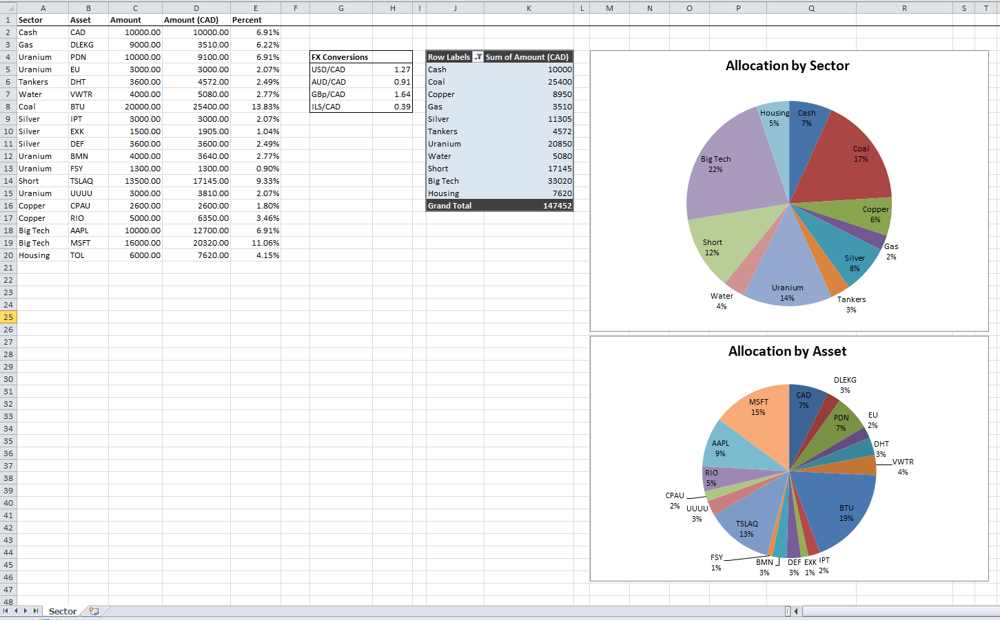

# Sector-Allocation-Charts

Excel document to visualize allocation size by sector and holdings. Delete the placeholder positions and input your own. The "Allocation by Asset" chart will update automatically. To update the "Allocation by Sector" chart, click on the pivot table, then click refresh. 

